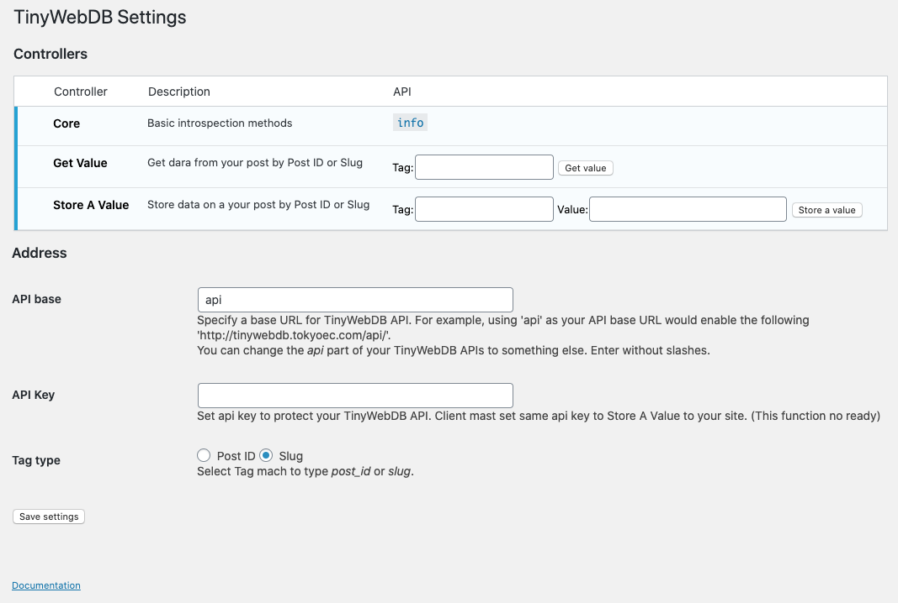

# TinyWebDB API #

**Contributors:** chen420  
Plugin URI: https://github.com/TinyWebDB/tinywebdb-api
Author URI: https://github.com/chen420  
Document URI: http://api.edu2web.com/tinywebdb-api/  
**Donate link:**  http://api.edu2web.com/tinywebdb-api/donate/  
**Tags:** appinventor, tinywebdb, api  
**Requires at least:** 4.0  
**Requires PHP:** 5.2.4  
**Tested up to:** 5.4  
**Stable tag:** 0.2.11
**License:** GPLv2 or later  
**License URI:** http://www.gnu.org/licenses/gpl-2.0.html  

a AppInventor TinyWebDB API plugin, use you WordPress as a TinyWebDB web service.
We also have lso have a TinyWebDB implementation based on PHP and textfile. No database is required.
https://github.com/TinyWebDB/tinywebdb-php

## Description ##

AppInventor is a easy way to creating an Android app from web browser.
TinyWebDB API is a AppInventor TinyWebDB API plugin, use you WordPress as a TinyWebDB web service.

TinyWebDB Protocol:  

|    Action        |URL                      |Post Parameters  |Response                          |
|------------------|-------------------------|-----------------|----------------------------------|
|    Get Value     |{ServiceURL}/getvalue    |tag              |JSON: ["VALUE","{tag}", {value}]  |
|    Store A Value |{ServiceURL}/storeavalue |tag,value        |JSON: ["STORED", "{tag}", {value}]|

Roadmap:
*    TinyWebDB API 0.1.0 implemented Get Value Action.
*    TinyWebDB API 0.2.0 will implement Store A Value Action.
*    TinyWebDB API 0.3.0 will implement Authentication.
*    TinyWebDB API 1.0.0 Full release.

Visit Plugin URI for detail.

## Installation ##

1. FTP the entire tinywebdb-api directory to your Wordpress blog's plugins folder (/wp-content/plugins/).
2. Activate the plugin on the "Plugins" tab of the administration panel.
3. Check test URL on admin menu to make sure API work properly.
4. Refer to Plugin URI to get sample Android test app which make by App Inventor, to create your own app.

for how to use AppInventor to inventor your Android app with this plugin , visit Plugin URI for detail please.

## Upgrade Notice ##
1. Deactivate plugin
2. Upload updated files
3. Reactivate plugin

Upgrade notes:
*  You may use the automated plugin updater in WordPress 2.5+ with this plugin, but make sure you read the upgrade notes of the latest version after upgrading.

### 1.0 ###

## Frequently Asked Questions ##
### How api key work ###

api key still reserved.
api key will be use for authentication, it will implement after v 0.3.0.
Because original TinyWebDB API do not include specification for authentication, 
we tring to find a auth way which compatible with original TinyWebDB API.  

## Screenshots ##

The TinyWebDB API management page in the WordPress Admin.

## Known Issues ##

## Changelog ##

### 0.1.0 ###  
Start TinyWebDB API plugin.

### 0.1.3 ###  
First alpha release which implemented Get Value Action.

### 0.2.0 ###  
Release which implemented Get Value Action with API Key.
Add test URL on admin menu.

### 0.2.2 ###  
Re-write code with oo-calss style.

### 0.2.7 ###  
Refine API from original tinywebdb.

### 0.2.8 ###  
Active "Store A Value" and some enhancement.

### 0.2.9 ### 
Active log viewer and some enhancement.

### 0.2.11 ###  
App PHP7 support.
App test form on admin page.

### 1.0.0 ###  
